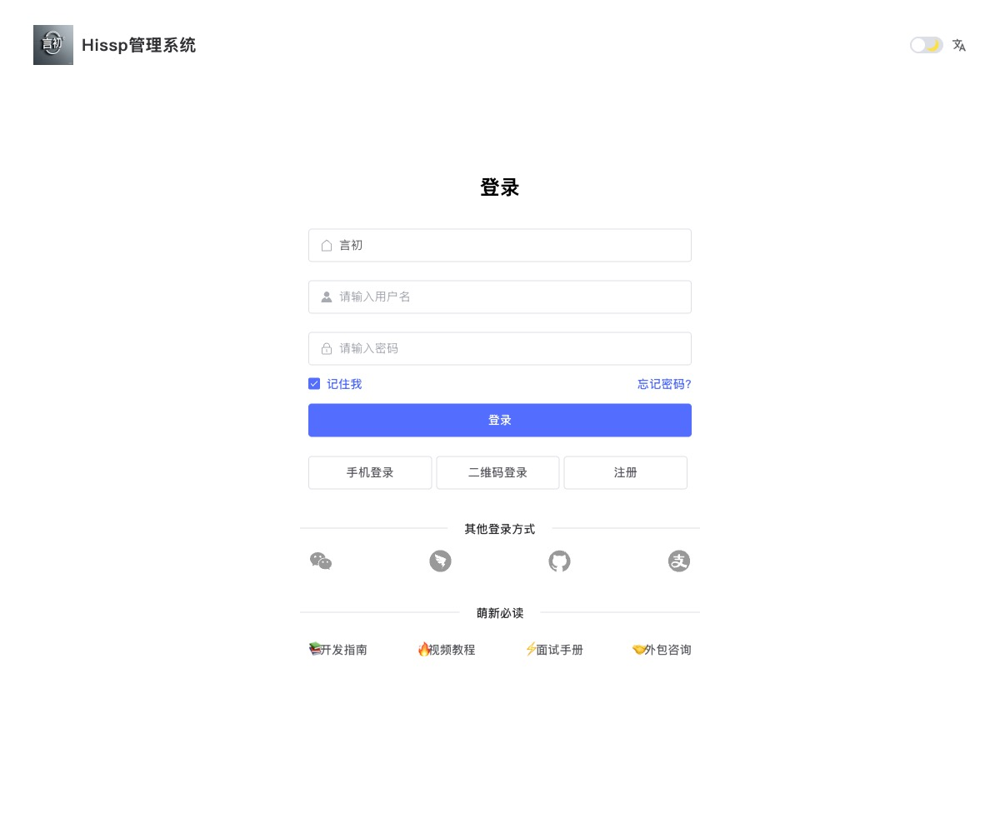
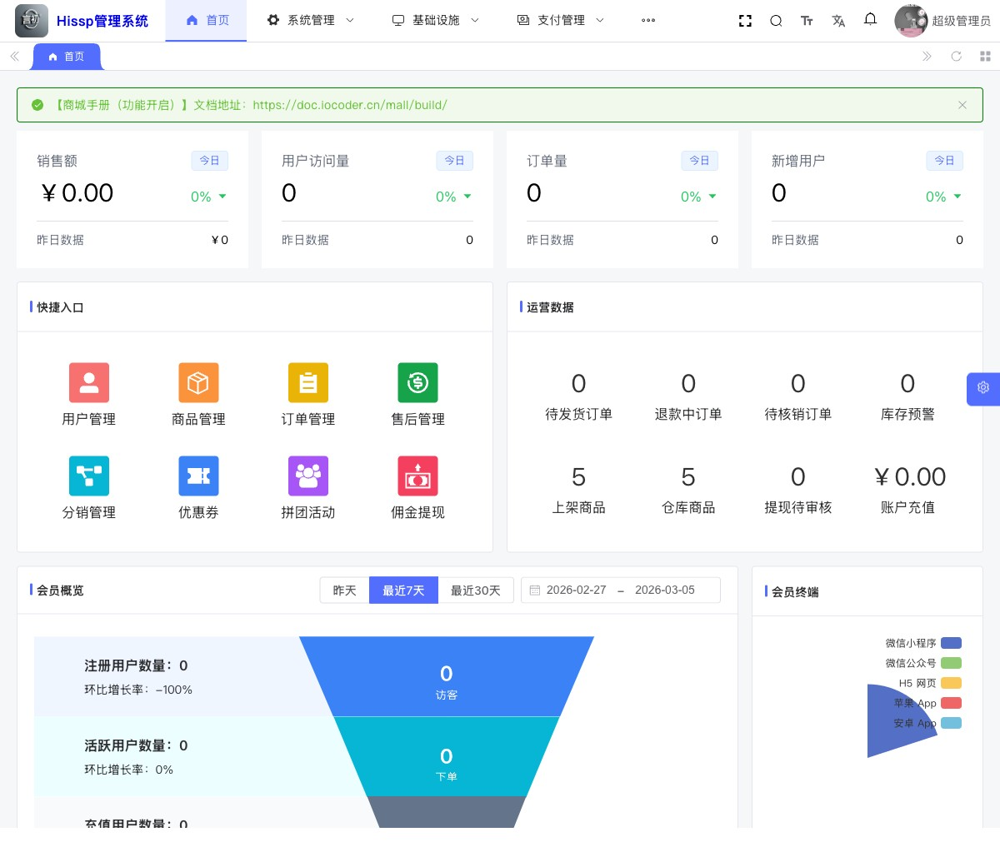
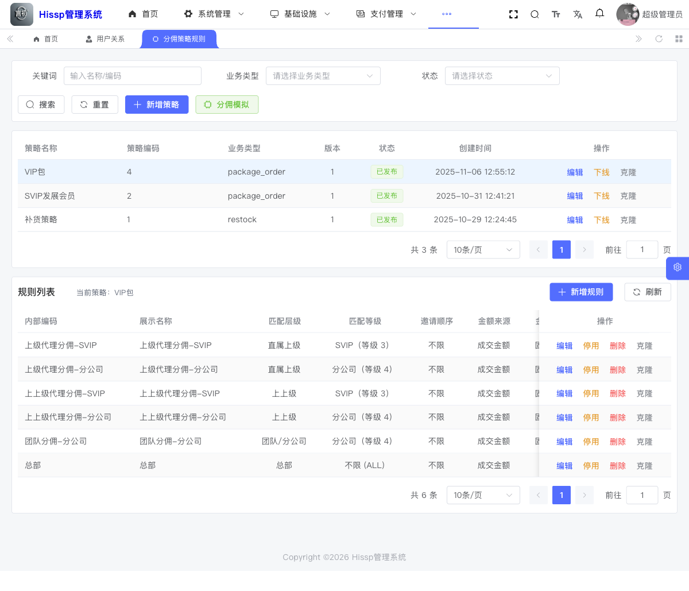
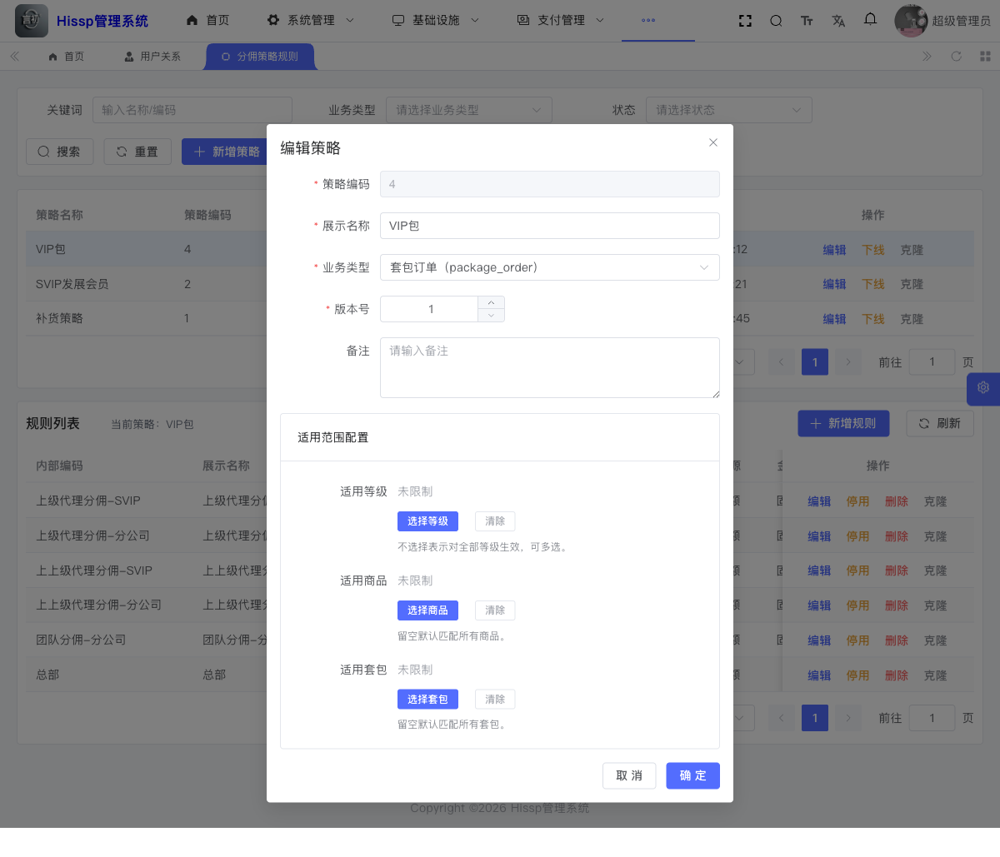
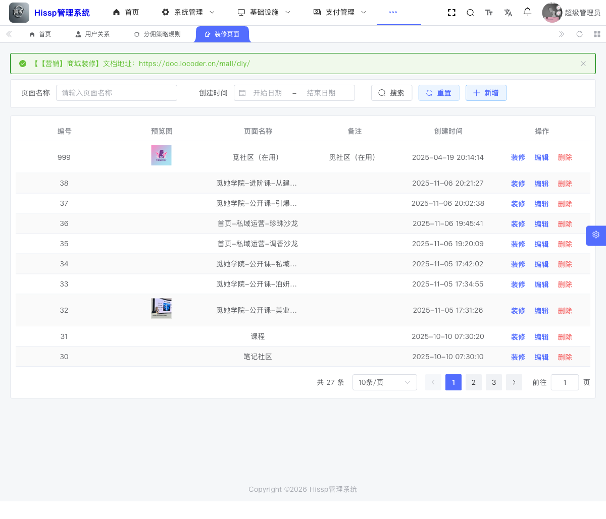
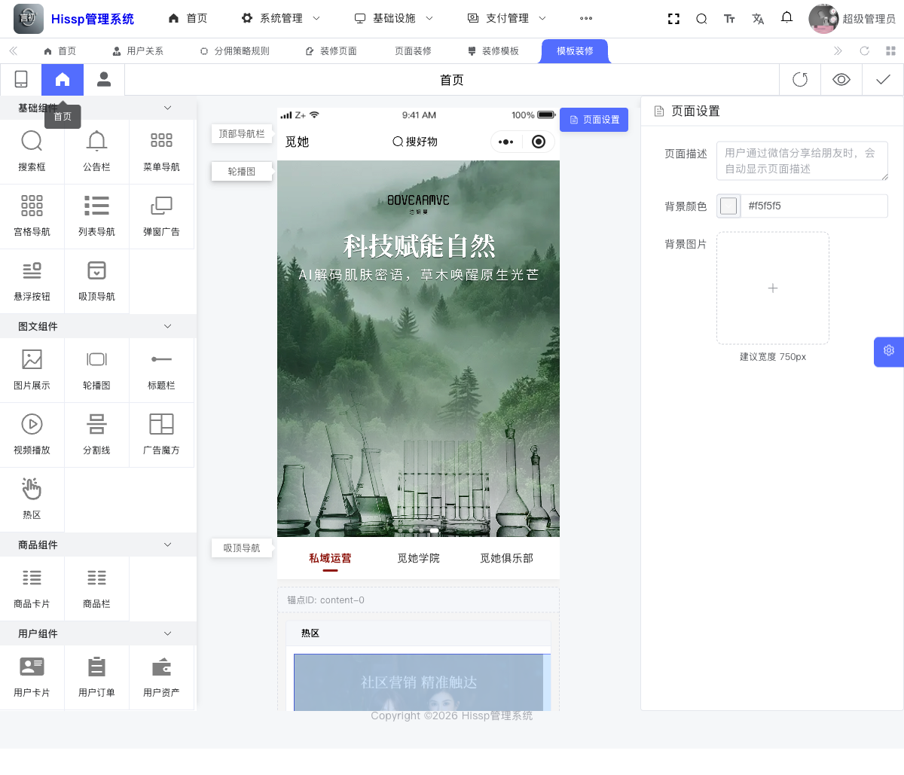
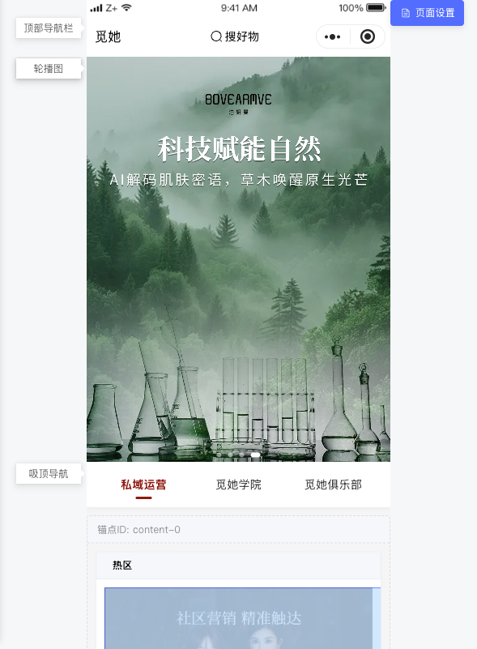

# Distribution 开源系统

[English](README.en.md) | 中文

一个基于yudao的前后端分离的分销业务系统，添加了前端分账、自定义装修功能扩展，包含后端服务、管理后台、商城移动端与配套 SQL/运维脚本。

## 项目概览

- 后端：Java 17 + Spring Boot + Maven
- 管理端：Vue 3 + Vite + TypeScript + Element Plus
- 商城端：uni-app + Vue 3（支持 H5/小程序）
- 基础组件：MySQL、Redis、RabbitMQ、RocketMQ（按需）

本仓库已完成开源脱敏，见 `DESENSITIZATION_REPORT.md`。

## 新增能力（扩展）

- 前端分账功能（结算规则、分账发起、状态追踪）：`src-claude-plus/docs/features/frontend-profit-sharing.md`
- 前端自定义装修功能（页面搭建、组件配置、发布流程）：`src-claude-plus/docs/features/frontend-page-decoration.md`

## 界面预览

### 登录页



### 首页



### 分销配置





### 装修





## 仓库结构

```text
.
├── src-claude-plus/
│   ├── backend/hissp-distribution/                 # Java 后端
│   ├── devops/                                     # 运维与部署脚本（已从 backend 目录迁出）
│   ├── frontend/yudao-ui-admin-vue3/               # 管理后台
│   ├── frontend/distribution-mall-mini-vue3/       # 商城移动端
│   └── docs/                                       # 业务文档
├── DESENSITIZATION_REPORT.md                       # 脱敏报告
├── OPEN_SOURCE_RELEASE_CHECKLIST.md                # 开源发布检查清单
└── .github/                                        # Issue/PR/CI 模板
```

## 环境要求

- JDK `17+`
- Maven `3.8+`
- Node.js `>=16`
- pnpm `>=8.6.0`（管理端推荐）
- Docker / Docker Compose（可选）

## 快速开始（本地开发）

### 1. 检查占位配置

以下文件中的 `CHANGE_ME_*` 需要按你的环境填写：

- `src-claude-plus/backend/hissp-distribution/distribution-server/src/main/resources/application-*.yaml`
- `src-claude-plus/devops/docker/docker.env`
- `src-claude-plus/frontend/yudao-ui-admin-vue3/.env*`
- `src-claude-plus/frontend/distribution-mall-mini-vue3/.env`
- `src-claude-plus/frontend/distribution-mall-mini-vue3/.e.*`
- `src-claude-plus/backend/hissp-distribution/settings.xml`

### 2. 启动后端

```bash
cd src-claude-plus/backend/hissp-distribution
mvn -q clean package -DskipTests
mvn -q -pl distribution-server -am spring-boot:run
```

### 3. 启动管理端

```bash
cd src-claude-plus/frontend/yudao-ui-admin-vue3
npm install
npm run dev
```

### 4. 启动商城端（H5）

```bash
cd src-claude-plus/frontend/distribution-mall-mini-vue3
npm install
npm run dev:h5
```

## Docker 快速部署

```bash
cd src-claude-plus/devops/docker
# 先修改 docker.env 中的 CHANGE_ME_* 占位值
docker compose up -d
```

可选：使用仓库自带脚本（交互式）

```bash
cd src-claude-plus/devops/docker
./startup.sh
```

## 默认端口

- 后端 API：`48080`
- 管理端：`88`
- 商城 H5：`3000`
- MySQL（Docker）：`43306`
- Redis（Docker）：`46379`

## 运维工具

- 运维脚本目录：`src-claude-plus/devops`
- Arthas 启动脚本：`src-claude-plus/devops/tools/as.sh`
